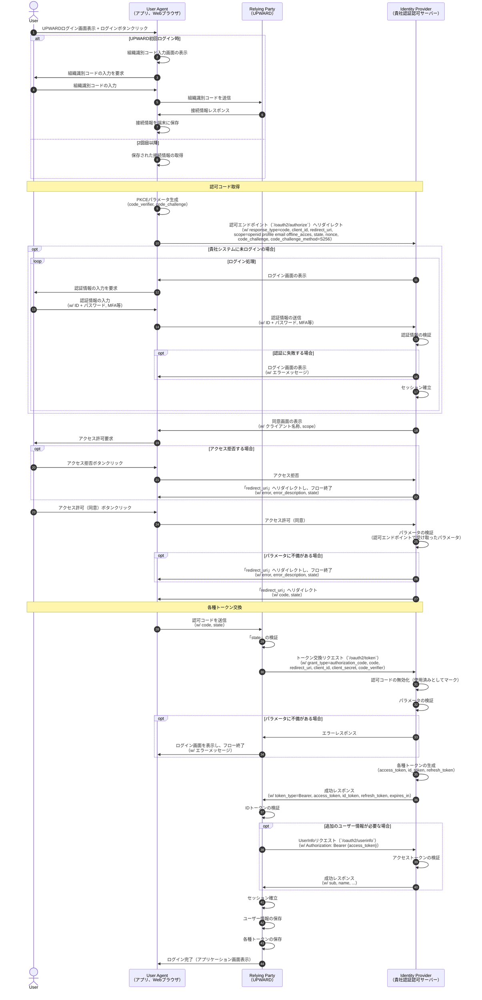
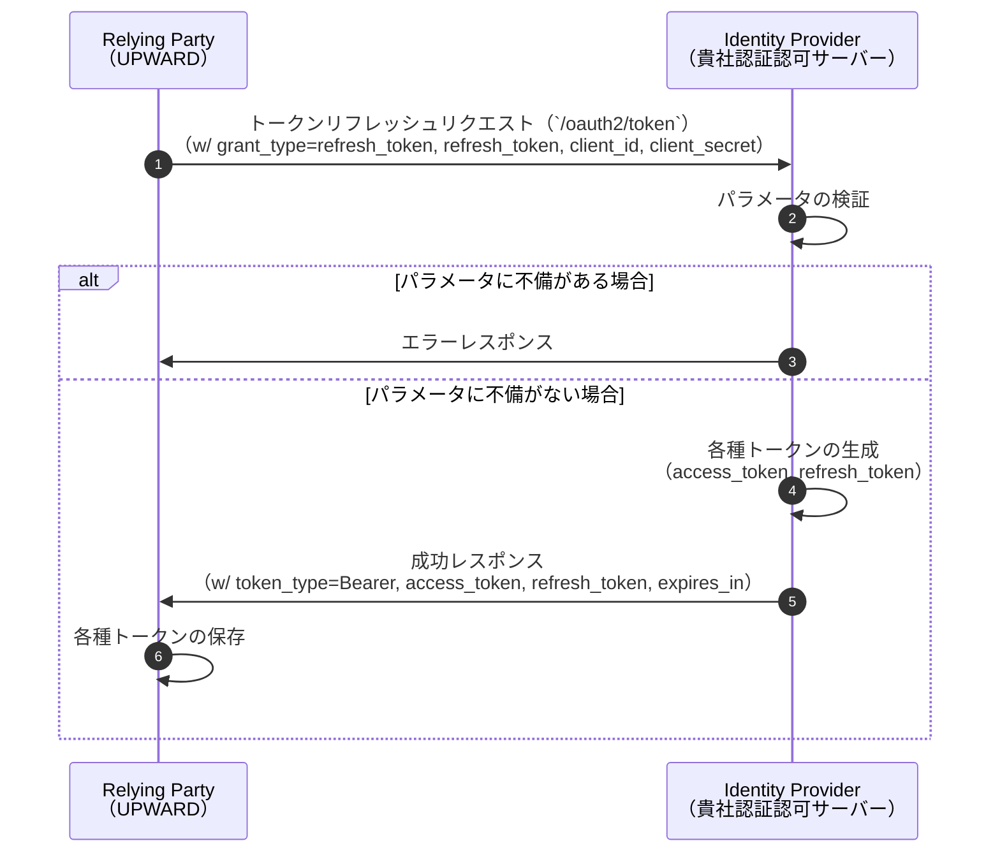

## 認証・認可フロー

```mermaid
sequenceDiagram
	autonumber

	actor User
	participant UA as User Agent<br/>（アプリ、Webブラウザ）
	participant RP as Relying Party<br/>（UPWARD）
	participant IdP as Identity Provider<br/>（貴社認証認可サーバー）

	User->>UA: UPWARDログイン画面表示 + ログインボタンクリック

	alt UPWARD初回ログイン時
		UA->>UA: 組織識別コード入力画面の表示
		UA->>User: 組織識別コードの入力を要求
		User->>UA: 組織識別コードの入力
		UA->>RP: 組織識別コードを送信
		RP->>UA: 接続情報レスポンス
		UA->>UA: 接続情報を端末に保存
	else 2回目以降
		UA->>UA: 保存された接続情報の取得
	end

	Note over User,IdP: 認可コード取得

	UA->>UA: PKCEパラメータ生成<br/>（code_verifier, code_challenge）
	UA->>IdP: 認可エンドポイント（`/oauth2/authorize`）へリダイレクト<br/>（w/ response_type=code, client_id, redirect_uri,<br/>scope=openid profile email offline_acces, state, nonce,<br/>code_challenge, code_challenge_method=S256）

	opt 貴社システムに未ログインの場合
		loop ログイン処理
			IdP->>UA: ログイン画面の表示
			UA->>User: 認証情報の入力を要求
			User->>UA: 認証情報の入力<br/>（w/ ID + パスワード, MFA等）
			UA->>IdP: 認証情報の送信<br/>（w/ ID + パスワード, MFA等）
			IdP->>IdP: 認証情報の検証
			opt 認証に失敗する場合
				IdP->>UA: ログイン画面の表示<br/>（w/ エラーメッセージ）
			end
			IdP->>IdP: セッション確立
		end
	end

	IdP->>UA: 同意画面の表示<br/>（w/ クライアント名称, scope）
	UA->>User: アクセス許可要求

	opt アクセス拒否する場合
		User->>UA: アクセス拒否ボタンクリック
		UA->>IdP: アクセス拒否
		IdP->>UA: 「redirect_uri」へリダイレクトし、フロー終了<br/>（w/ error, error_description, state）
	end

	User->>UA: アクセス許可（同意）ボタンクリック
	UA->>IdP: アクセス許可（同意）

	IdP->>IdP: パラメータの検証<br/>（認可エンドポイントで受け取ったパラメータ）

	opt パラメータに不備がある場合
		IdP->>UA: 「redirect_uri」へリダイレクトし、フロー終了<br/>（w/ error, error_description, state）
	end

	IdP->>UA: 「redirect_uri」へリダイレクト<br/>（w/ code, state）

	Note over User,IdP: 各種トークン交換

	UA->>RP: 認可コードを送信<br/>（w/ code, state）
	RP->>RP: 「state」の検証

	RP->>IdP: トークン交換リクエスト（`/oauth2/token`）<br/>（w/ grant_type=authorization_code, code,<br/>redirect_uri, client_id, client_secret, code_verifier）
	IdP->>IdP: 認可コードの無効化（使用済みとしてマーク）
	IdP->>IdP: パラメータの検証
	opt パラメータに不備がある場合
		IdP->>RP: エラーレスポンス
		RP->>UA: ログイン画面を表示し、フロー終了<br/>（w/ エラーメッセージ）
	end
	IdP->>IdP: 各種トークンの生成<br/>（access_token, id_token, refresh_token）
	IdP->>RP: 成功レスポンス<br/>（w/ token_type=Bearer, access_token, id_token, refresh_token, expires_in）

	RP->>RP: IDトークンの検証

	opt 追加のユーザー情報が必要な場合
		RP->>IdP: UserInfoリクエスト（`/oauth2/userinfo`）<br/>（w/ Authorization: Bearer {access_token}）
		IdP->>IdP: アクセストークンの検証
		IdP->>RP: 成功レスポンス<br/>（w/ sub, name, ...）
	end

	RP->>RP: セッション確立
	RP->>RP: ユーザー情報の保存
	RP->>RP: 各種トークンの保存

	RP->>UA: ログイン完了（アプリケーション画面表示）
```

## トークン更新フロー

```mermaid
sequenceDiagram
	autonumber

	participant RP as Relying Party<br/>（UPWARD）
	participant IdP as Identity Provider<br/>（貴社認証認可サーバー）

	RP->>IdP: トークンリフレッシュリクエスト（`/oauth2/token`）<br/>（w/ grant_type=refresh_token, refresh_token, client_id, client_secret）
	IdP->>IdP: パラメータの検証
	alt パラメータに不備がある場合
		IdP->>RP: エラーレスポンス
	else パラメータに不備がない場合
		IdP->>IdP: 各種トークンの生成<br/>（access_token, refresh_token）

		IdP->>RP: 成功レスポンス<br/>（w/ token_type=Bearer, access_token, refresh_token, expires_in）

		RP->>RP: 各種トークンの保存
	end
```